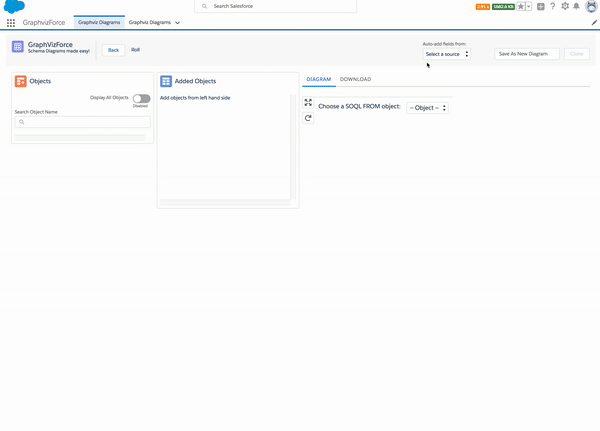

# Graphvizforce for Lightning

A Salesforce Entity Relationship diagramming tool built as a Lightning Component.

Replaces and improves [Graphvizforce for Visualforce](http://stevebuik.github.io/GraphVizForce)

Status: **In Development**. We will announce on social media when v1 is ready for user testing.

It's an alpha version because we finalised the storage format yet. This means that diagrams will need to be recreated after an upgrade.
Despite that, it's still stable and valuable to use in the current state.
We'll stop with breaking changes in the beta release which will be soon as we are working on the storage format now.

Currently we are distributing using a *managed* package but will convert to an *unlocked* package as soon as they are available.

## Features

**Graphviz Rendering**

Automatically layout of an ERD diagram based on Objects/Fields of your choice.
Exportable in Graphviz or SVG format if you want to use these diagrams in documentation.

Save (or clone) your diagrams for later so that you can modify them later.

**Automatic diagram generation**

Scans Apex Classes or Triggers to find Object/Field references and adds them to the diagram.

In future, other sources will be added e.g. Reports and Dashboards.
It's open for extension so you can create your own custom sources if required.

**SOQL Generation**

Any diagram can be rendered as a SOQL join query, with support for joins via parent and child relationships.
1-click copy of the SOQL makes it easy to move into your favourite query runner.

## Developers

If you would like to contribute to this project, we welcome any help.
Please first look at the [issues marked *help wanted*](https://github.com/stevebuik/Graphvizforce-Lightning/issues) and contact us to check if anybody else is already working on it.

Then [follow these instructions](https://github.com/stevebuik/Graphvizforce-Lightning/tree/master/doc/development.md) to setup your development environment.

You might also want to clone/setup this project to learn some of the techniques we use.
You can also [read the posts on this blog](http://stevebuikhuizen.online), as we will explain the design in more detail there.

## Architecture

We document our architectural decisions using a standard [Architecture Review Document](http://thinkrelevance.com/blog/2011/11/15/documenting-architecture-decisions) format.

These documents can be seen in [the ADR dir](https://github.com/stevebuik/Graphvizforce-Lightning/tree/master/doc/ADR).

## Issues

We manage our roadmap and defects as [Github issues](https://github.com/stevebuik/Graphvizforce-Lightning/issues)

## Acknowledgements

Thanks [Jason Guan](https://www.linkedin.com/in/jason-guan-3463a939/) for working on v1 and initiating the v2.

Thanks [Andrew Fawcett](https://www.linkedin.com/in/andyfawcett/) for the [UML Canvas](https://github.com/afawcett/apex-umlcanvas) project. We used [2 classes](https://github.com/stevebuik/Graphvizforce-Lightning/blob/master/graphviz/main/default/classes/ToolingAPI.cls) from that project to create the *Auto-Build* feature.

And thank you if you are using this tool. We volunteer our time for the satisfaction of knowing that people use the tools that we make.

## Licence

Graphvizforce is free and unencumbered public domain software. For more information, see http://unlicense.org/ or the accompanying UNLICENSE file.