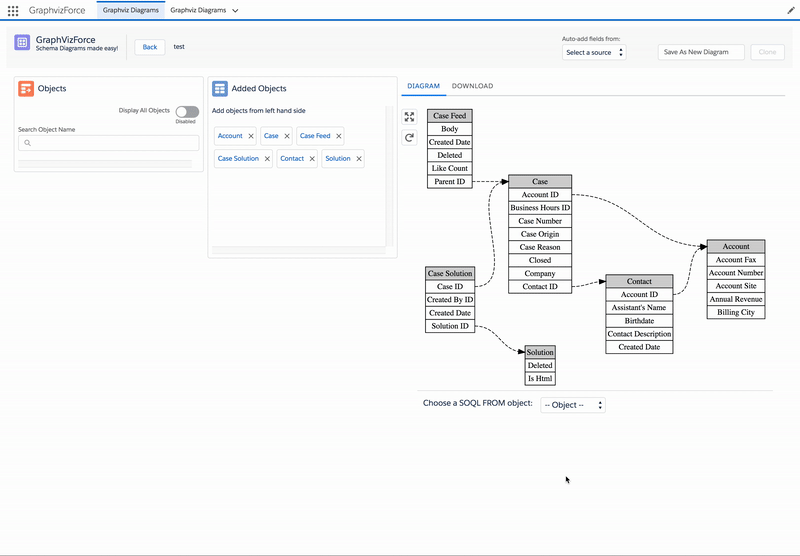

# Graphvizforce for Lightning

A Salesforce Entity Relationship diagramming tool built as a Lightning Component.

Replaces and improves [Graphvizforce for Visualforce](http://stevebuik.github.io/GraphVizForce)

Status: **In Development**. We will announce on social media when v1 is ready for user testing.

TODO setup Travis CI with build indicator

## Features

**Graphviz Rendering**

Automatically layout of an ERD diagram based on Objects/Fields of your choice.
Exportable in Graphviz or SVG format if you want to use these diagrams in documentation.

Save (or clone) your diagrams for later so that you can modify them later.

**Automatic diagram generation**

Scans Apex Classes or Triggers to find Object/Field references and adds them to the diagram.
In future, other sources will be added e.g. Reports and Dashboards.
It's open for extension so you can create your own custom sources if required.

**SOQL Generation**

Any diagram can be rendered as a SOQL join query, with support for joins via parent and child relationships.
1-click copy of the SOQL makes it easy to move into your favourite query runner.

See it action:

## Getting started as a developer

First, clone this project to your local filesystem.

You will need access to a *Developer Hub* org. You can do by this enabling the dev hub feature in your production org
or [signing up for a 30 trial org](https://developer.salesforce.com/promotions/orgs/dx-signup) with the dev hub enabled.

Then you should install the SFDX CLI and

Login to the dev hub org using this command: (a new browser window will open)

`sfdx force:auth:web:login --setdefaultdevhubusername --setalias my-hub-org`

Now you are ready to create a new scratch org:

`sfdx force:org:create --definitionfile config/project-scratch-def.json --durationdays 30 --setalias scratch1 --setdefaultusername`

List all orgs to see which you have setup and connected to your SFDX CLI:

`sfdx force:org:list`

At any time you can open/login a window to new (default) scratch org:

`sfdx force:org:open --path one/one.app`

Now, install the Lightning Testing Service:

`sfdx force:lightning:test:install`

Deploy the code (ensure you are in graphvizforce-lightning dir):

`sfdx force:source:push`

Assign permission set to access the App and Tab:

`sfdx force:user:permset:assign --permsetname graphvizforce`

Now refresh Lightning Experience and you should be able to switch to the **Graphvizforce** app and
see the single tab where the ERD component is available.

If you use the *Developer Console* as your IDE, any changes made in your scratch org can be *pulled* back
to the local dir using:

`sfdx force:source:pull`

..and then committed to SCM as normal.

## Linting

We use the Lightning Linter to check our code. To run this locally use:

`sfdx force:lightning:lint graphviz`

## Testing

#### Apex tests

`sfdx force:apex:test:run` and follow the instruction returned.

#### Lightning Tests

Use the [Lightning Testing Service](https://forcedotcom.github.io/LightningTestingService/) (Jasmine flavoured) to test the components in this project.
Use the following commands to run the tests:

`sfdx force:lightning:test:run -a DiagramViewerTests.app`

or you can run the testing app in the browser using:

`sfdx force:org:open --path c/DiagramViewerTests.app`

#### Jasmine / Node Tests

`cd js/pure`

`npm install`

`./node_modules/jasmine-node/bin/jasmine-node spec`

#### Development Mode

If you are doing development on this tool, it is useful to enable *development mode*

To enable it, add a new custom setting in *Graphviz Config* with Name = *development mode*
and Value = *TRUE*

This will:

* cause the Apex auto-build to include Apex classes from this project when generating a diagram

#### Lightning Development

Although testing the full application is important, refreshing it after changes is slow.
For this reason, there's also TestApp.app which refreshes much faster. It will not support tooling API features.

#### Javascript Development

Functions that have complex logic are built using npm tooling to provide instant feedback when changing code.

`cd js/pure`

`npm install`

`./node_modules/jasmine-node/bin/jasmine-node --watch src test  --autotest --color spec`

## Description of Files and Directories

This project uses SFDX for all stages.

## Architecture

We document our architectural decisions using a standard [Architecture Review Document](http://thinkrelevance.com/blog/2011/11/15/documenting-architecture-decisions) format.

These documents can be seen in [the ADR dir](https://github.com/stevebuik/Graphvizforce-Lightning/tree/master/doc/ADR).

## Issues

We manage our roadmap and defects as [Github issues](https://github.com/stevebuik/Graphvizforce-Lightning/issues)

